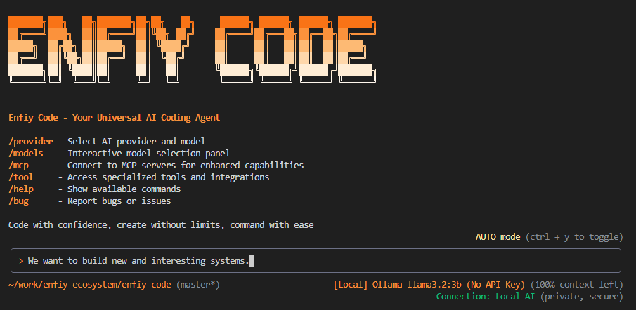

<h1 align="center">Enfiy Code</h1>
<p align="center">A universal AI coding agent — local or cloud, your choice</p>

<p align="center"><code>npm install @enfiy/enfiy-code</code></p>

<p align="center">
  
</p>



This repository contains the Enfiy Code, a command-line AI workflow tool that connects to your
tools, understands your code and accelerates your workflows.

With Enfiy Code you can:

- Query and edit large codebases with powerful AI models including support for large context windows.
- Generate new apps from PDFs or sketches, using multimodal AI capabilities.
- Automate operational tasks, like querying pull requests or handling complex rebases.
- Use tools and MCP servers to connect new capabilities, including [media generation with Imagen,
  Veo or Lyria](https://github.com/GoogleCloudPlatform/vertex-ai-creative-studio/tree/main/experiments/mcp-genmedia)
- Ground your queries with web search capabilities when using supported AI providers.

## ⚠️ Experimental Technology Disclaimer

Enfiy Code is an experimental AI-powered development tool that integrates with various AI providers and services. Please be aware of the following:

- **Experimental Nature**: This software is under active development and may contain bugs, unexpected behavior, or incomplete features.
- **AI Model Limitations**: AI responses may be incorrect, biased, or inappropriate. Always review and validate AI-generated code and suggestions.
- **Data Security**: While we implement security measures, be cautious when working with sensitive codebases or proprietary information.
- **Third-Party Dependencies**: Enfiy Code integrates with external AI services and tools. We are not responsible for the availability, performance, or policies of these third-party services.
- **Breaking Changes**: As an experimental tool, future updates may introduce breaking changes without extensive deprecation periods.

**Use at your own risk and discretion. Always backup your code and review AI-generated changes before implementation.**

## Why Enfiy Code?

In the rapidly evolving landscape of software development, developers face increasing complexity in managing large codebases, integrating multiple tools, and keeping up with diverse technologies. Enfiy Code addresses these challenges by providing:

### 🎯 **Universal AI Integration**
- **One Tool, Many Models**: Switch seamlessly between different AI providers (OpenAI, Anthropic, Google, Mistral, local models) without changing your workflow.
- **Best-in-Class Selection**: Choose the most appropriate AI model for your specific task, from code generation to analysis to documentation.

### 🔧 **Intelligent Code Understanding**
- **Context-Aware Analysis**: Understand large codebases with AI that can process thousands of lines of code and maintain context across multiple files.
- **Smart Suggestions**: Get relevant suggestions based on your project's architecture, coding patterns, and dependencies.

### 🚀 **Workflow Acceleration**
- **Automated Tasks**: Reduce repetitive work with AI-powered automation for testing, documentation, refactoring, and deployment.
- **Rapid Prototyping**: Build applications faster with AI assistance for boilerplate code, architecture decisions, and implementation strategies.

### 🔒 **Privacy and Control**
- **Local and Cloud Options**: Choose between cloud-based AI services for power or local models for complete privacy.
- **Secure Storage**: API keys and sensitive data are encrypted and stored locally with industry-standard security practices.

### 🛠️ **Extensible Architecture**
- **MCP Integration**: Connect to any tool or service through the Model Context Protocol (MCP) for unlimited extensibility.
- **Custom Tools**: Build and integrate custom tools that fit your specific development workflow.

## Quickstart

1. **Prerequisites:** Ensure you have [Node.js version 18](https://nodejs.org/en/download) or higher installed.
2. **Run the CLI:** Execute the following command in your terminal:

   ```bash
   npx @enfiy/enfiy-code
   ```

   Or install it globally with:

   ```bash
   npm install -g @enfiy/enfiy-code
   enfiy
   ```

3. **First-time setup:** When you run Enfiy Code for the first time, you'll be guided through:
   - Picking a color theme
   - Selecting an AI provider (local or cloud)
   - Configuring authentication for your chosen provider

4. **Smart configuration:** Once configured, Enfiy Code will remember your settings and automatically use your last selected model on subsequent runs.

You are now ready to use Enfiy Code!

## Supported AI Providers

Enfiy Code supports both local and cloud AI providers:

### Cloud Providers
- **Anthropic Claude** - Industry-leading AI for coding tasks
- **OpenAI GPT** - Popular and versatile language models
- **Google Gemini** - Multimodal AI with excellent reasoning capabilities
- **Mistral AI** - Open-source focused AI models
- **HuggingFace** - Access to a wide variety of open-source models

### Local Providers
- **Ollama** - Run models locally with full privacy
- **LM Studio** - User-friendly local model hosting
- **llama.cpp** - Efficient C++ implementation for local inference
- **vLLM** - High-performance inference engine
- **Text Generation UI** - Web-based interface for local models

## Development Installation

For development or to use the latest features:

```bash
# Clone the repository
git clone https://github.com/enfiy-ecosystem/enfiy-code.git
cd enfiy-code

# Install dependencies
npm install

# Build the project
npm run build

# Run locally
npm start

# Or link for global development use
npm link
enfiy
```

### Manual API Key Configuration

If you prefer to configure API keys manually or need advanced configuration:

1. **For Gemini**: Generate a key from [Google AI Studio](https://aistudio.google.com/apikey).
   ```bash
   export GEMINI_API_KEY="YOUR_API_KEY"
   ```

2. **For Anthropic**: Get your API key from [Anthropic Console](https://console.anthropic.com/).
   ```bash
   export ANTHROPIC_API_KEY="YOUR_API_KEY"
   ```

3. **For OpenAI**: Generate a key from [OpenAI Platform](https://platform.openai.com/api-keys).
   ```bash
   export OPENAI_API_KEY="YOUR_API_KEY"
   ```

4. **For Ollama**: Set up your local Ollama server.
   ```bash
   export OLLAMA_HOST="http://localhost:11434"
   ```

5. **For other providers**: See the [authentication](./docs/cli/authentication.md) guide for configuration details.

## Core Commands

### `/provider` - AI Provider Management

The `/provider` command allows you to manage AI providers and switch between different models:

```bash
# List available providers
/provider

# Switch to a specific provider
/provider anthropic

# List models for current provider
/provider models

# Switch to a specific model
/provider model claude-3-sonnet-20240229

# Show current provider status
/provider status

# Configure provider settings
/provider config
```

**Provider Management Features:**
- **Dynamic Switching**: Change AI providers without restarting the application
- **Model Selection**: Choose from available models for each provider
- **Configuration**: Set up API keys, endpoints, and provider-specific settings
- **Status Monitoring**: Check connection status and model availability
- **Fallback Support**: Automatically switch to backup providers if primary fails

### `/mcp` - Model Context Protocol Integration

The `/mcp` command manages MCP (Model Context Protocol) servers for extending Enfiy Code's capabilities:

```bash
# List installed MCP servers
/mcp list

# Install a new MCP server
/mcp install <server-name>

# Start/Stop MCP servers
/mcp start <server-name>
/mcp stop <server-name>

# Configure MCP server settings
/mcp config <server-name>

# Show MCP server status
/mcp status

# Enable/disable tool descriptions
/mcp desc
/mcp nodesc
```

**MCP Integration Features:**
- **Extensible Tools**: Connect to databases, APIs, cloud services, and more
- **Custom Servers**: Build and integrate your own MCP servers
- **Real-time Communication**: Bi-directional communication with external tools
- **Security**: Secure communication protocols and permission management
- **Popular MCP Servers**: File system, Git, database, web search, and many more

### Tools - Built-in Development Tools

Enfiy Code includes a comprehensive set of built-in tools for development tasks:

#### **File Operations**
```bash
# Read files with syntax highlighting
> Read the main.py file and explain its structure

# Edit multiple files simultaneously
> Update both the API endpoint and the frontend component to add user authentication

# Create new files and directories
> Create a new React component for user settings
```

#### **Code Analysis**
```bash
# Analyze code quality and suggest improvements
> Review this codebase for security vulnerabilities

# Generate documentation
> Create comprehensive documentation for this API

# Refactor code
> Refactor this function to use modern JavaScript features
```

#### **Version Control**
```bash
# Git operations
> Create a feature branch for the new login system

# Commit and push changes
> Commit these changes with an appropriate message

# Handle merge conflicts
> Help me resolve this merge conflict
```

#### **Testing and Debugging**
```bash
# Generate tests
> Write unit tests for this component

# Debug issues
> Help me debug this error in the console

# Performance analysis
> Analyze the performance of this algorithm
```

#### **System Integration**
```bash
# Shell commands
> Run the test suite and show me the results

# Environment management
> Set up the development environment for this project

# Build and deployment
> Build the project and deploy it to staging
```

## Examples

Once the CLI is running, you can start interacting with AI models from your shell.

You can start a project from a new directory:

```sh
cd new-project/
enfiy
> Write me a Discord bot that answers questions using a FAQ.md file I will provide
```

Or work with an existing project:

```sh
git clone https://github.com/enfiy-ecosystem/enfiy-cli
cd enfiy-cli
enfiy
> Give me a summary of all of the changes that went in yesterday
```

### Next steps

- Explore the available **[CLI Commands](./docs/cli/commands.md)**.
- If you encounter any issues, review the **[Troubleshooting guide](./docs/troubleshooting.md)**.
- For more comprehensive documentation, see the [full documentation](./docs/index.md).
- Take a look at some [popular tasks](#popular-tasks) for more inspiration.

## Popular tasks

### Explore a new codebase

Start by `cd`ing into an existing or newly-cloned repository and running `enfiy`.

```text
> Describe the main pieces of this system's architecture.
```

```text
> What security mechanisms are in place?
```

### Work with your existing code

```text
> Implement a first draft for GitHub issue #123.
```

```text
> Help me migrate this codebase to the latest version of Java. Start with a plan.
```

### Automate your workflows

Use MCP servers to integrate your local system tools with your enterprise collaboration suite.

```text
> Make me a slide deck showing the git history from the last 7 days, grouped by feature and team member.
```

```text
> Make a full-screen web app for a wall display to show our most interacted-with GitHub issues.
```

### Interact with your system

```text
> Convert all the images in this directory to png, and rename them to use dates from the exif data.
```

```text
> Organise my PDF invoices by month of expenditure.
```

## Features

### Smart Provider Management
- **Automatic configuration detection** - Skip setup dialogs when already configured
- **Last model restoration** - Automatically restore your previously used model
- **Secure credential storage** - API keys are encrypted and stored securely
- **Multi-provider support** - Easily switch between different AI providers

### Enhanced User Experience
- **Streamlined startup** - Get to coding faster with intelligent configuration checks
- **Persistent settings** - Your preferences are remembered across sessions
- **Intuitive setup flow** - Clear guidance for first-time users
- **Flexible authentication** - Support for API keys, OAuth, and subscription plans

### Development Tools
- **Large codebase support** - Handle projects of any size with intelligent context management
- **Multi-file editing** - Make changes across multiple files simultaneously
- **Code analysis** - Understand complex codebases with AI-powered insights
- **Workflow automation** - Automate repetitive coding tasks

## Bug Reports and Issues

We appreciate your help in improving Enfiy Code! If you encounter any bugs or issues, please use the following command within the application:

```bash
/bug "Description of the issue you encountered"
```

This will:
- Collect relevant system information
- Capture logs and error details
- Create a formatted bug report
- Provide guidance on next steps

### Alternative Reporting Methods

If you cannot use the `/bug` command, you can also:

1. **GitHub Issues**: Report bugs at [https://github.com/enfiy-ecosystem/enfiy-code/issues](https://github.com/enfiy-ecosystem/enfiy-code/issues)
2. **Include the following information**:
   - Enfiy Code version (`enfiy --version`)
   - Operating system and version
   - Node.js version
   - Steps to reproduce the issue
   - Expected vs actual behavior
   - Any error messages or logs

### Security Issues

For security-related issues, please do not create public GitHub issues. Instead:
- Use the `/bug` command with security-related details
- Contact us directly at security@enfiy.dev
- Follow responsible disclosure practices

## Data Collection, Use, and Retention

Enfiy Code is designed with privacy and security in mind. Here's what you need to know about data handling:

### What Data We Collect

#### **Local Data (Stored on Your Device)**
- **Configuration Settings**: Theme preferences, provider selections, and application settings
- **API Keys**: Encrypted and stored locally in your home directory (`~/.enfiy/`)
- **Usage Logs**: Local debugging information and error logs
- **Project Context**: Temporary context about your current project (not transmitted unless explicitly requested)

#### **Telemetry Data (Optional)**
- **Usage Statistics**: Command usage patterns and feature adoption (anonymized)
- **Error Reports**: Crash reports and error information when using `/bug` command
- **Performance Metrics**: Application performance and response times

### How We Use Your Data

- **Improve Enfiy Code**: Identify common issues and optimize performance
- **Debug Issues**: Help troubleshoot problems when you report bugs
- **Feature Development**: Understand which features are most valuable to users
- **Security**: Detect and prevent misuse of the service

### Data Transmission

#### **AI Provider Communications**
- **Your Code**: Sent to selected AI providers (OpenAI, Anthropic, Google, etc.) for processing
- **Context Information**: Project structure and file contents when explicitly requested
- **Your Choice**: You control which AI provider to use and what data to share

#### **MCP Server Communications**
- **Tool Interactions**: Data shared with MCP servers based on your commands
- **External Services**: Third-party MCP servers may have their own data policies

### Data Retention

- **Local Data**: Stored indefinitely on your device until manually deleted
- **Telemetry**: Anonymized usage data retained for up to 2 years
- **Bug Reports**: Stored for up to 1 year or until issue resolution
- **AI Provider Data**: Subject to each provider's retention policies

### Your Data Rights

- **Opt-Out**: Disable telemetry in settings (`/settings telemetry false`)
- **Local Control**: All configuration and keys stored locally
- **Data Deletion**: Remove all local data by deleting `~/.enfiy/` directory
- **Transparency**: View collected data through debug commands

### Data Security

- **Encryption**: API keys encrypted using AES-256-GCM
- **Local Storage**: No sensitive data stored on our servers
- **Secure Transmission**: All communications use TLS encryption
- **Access Control**: Strict access controls on any collected telemetry

### Third-Party Data Policies

When using external AI providers or MCP servers, you are also subject to their privacy policies:

- **OpenAI**: [OpenAI Privacy Policy](https://openai.com/privacy)
- **Anthropic**: [Anthropic Privacy Policy](https://www.anthropic.com/privacy)
- **Google**: [Google Privacy Policy](https://policies.google.com/privacy)
- **Local Models**: No external data transmission

### Contact Information

For privacy-related questions or concerns:
- Email: privacy@enfiy.dev
- Use the `/bug` command for privacy-related issues
- GitHub: [Privacy Policy Issues](https://github.com/enfiy-ecosystem/enfiy-code/issues)

## Contributing

We welcome contributions to Enfiy Code! Please see our [contributing guidelines](./CONTRIBUTING.md) for more information on how to get started.

## License

Enfiy Code is licensed under the [Apache 2.0 License](./LICENSE).